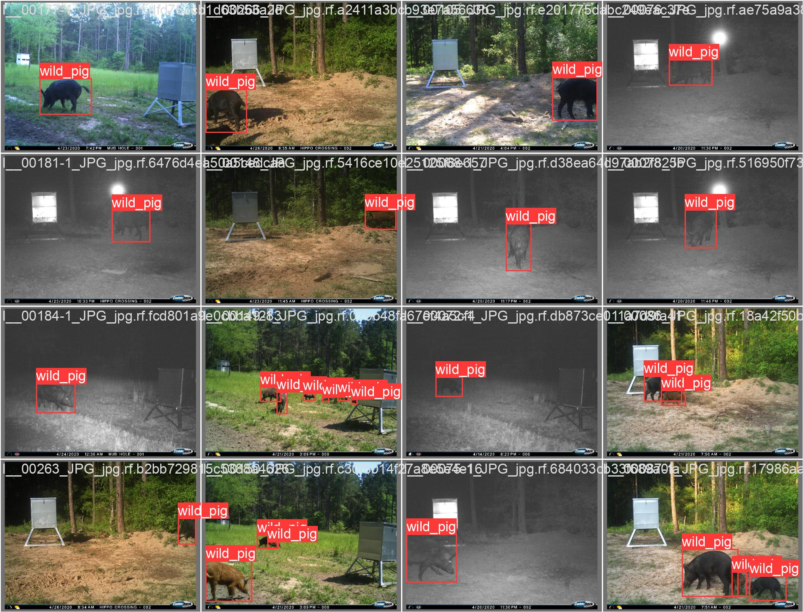

## Wild Pig - Traffic Insight Tool 🎁
This project is designed to analyze Wild Pig in real environments. It enables store owners and researchers to understand customer movement patterns, as well as time in specific zones, and overall store dynamics.

## Features 🤓

- **Movement Analysis**: Tracks how people move throughout the place.
- **Integration with YOLO**: Allows for specific queries on detected objects and individuals.
- **Multi-Camera Tracking**: Capable of tracking individuals across multiple camera feeds.
- **Model Retraining**: Saves random images to re-train the machine learning model for improved accuracy.
- **Heat Maps**: Generates heat maps to visualize high-traffic areas.
- **Track Path**: Generate the path of the object.

## Prerequisites 📌

Before running this system, you need to:

- Install Python 3.9 or above.
- Ensure you have the required hardware to process video feeds in real-time.
- Set up the necessary camera infrastructure as per the system's requirements.

## Installation

```bash
git clone https://github.com/AdonaiVera/wildboard-behavior-analysis.git
cd wildboard-behavior-analysis
pip install git+https://github.com/AdonaiVera/supervision.git@add_time_byte_tracking
pip install ultralytics
```

## Usage 📌

To start analyzing a video stream:

```python
from behavior_analysis import process_video

# Example
camera_entry = [{
    "url": "input/wild_pig_demo.mp4",
    "confidence_threshold": 0.4,
    "target_video_path": "output/result_yolov8.mp4",
    "switch_model": "models/yolov8_v3.pt", # "yolov8l-worldv2.pt"
    "iou_threshold": 0.7,
}]
```

Replace the paths and parameters with those relevant to your specific setup, you have to download your model or ask for the model of the project.

```bash
python run.py
```

## Infrastructure 📦 
Pending to develop

## Results 📊

### Video Demo


*Embed your video here to demonstrate the system in action.*

### Image Results

#### Detection Example


## Next steps
1. Integrate with yolo-world
2. Tracking wildboard in multiples cameras.
3. Classify Baby and adults. 

## Contributing 🤓

Interested in contributing? Great! Here's how you can:

1. Fork the repository.
2. Create a new branch (`git checkout -b feature-branch`).
3. Commit your changes (`git commit -am 'Add some feature'`).
4. Push to the branch (`git push origin feature-branch`).
5. Create a new Pull Request.

## Acknowledgments 🎁

If you are interested in building on top of this, feel free to reach out :) 
* **Adonai Vera** - *AI ML Subterra AI* - [AdonaiVera](https://github.com/AdonaiVera)
* **Donghoon Kim** - *Assistant Professor* - [DonghoonKim](https://researchdirectory.uc.edu/p/kim3dn)

